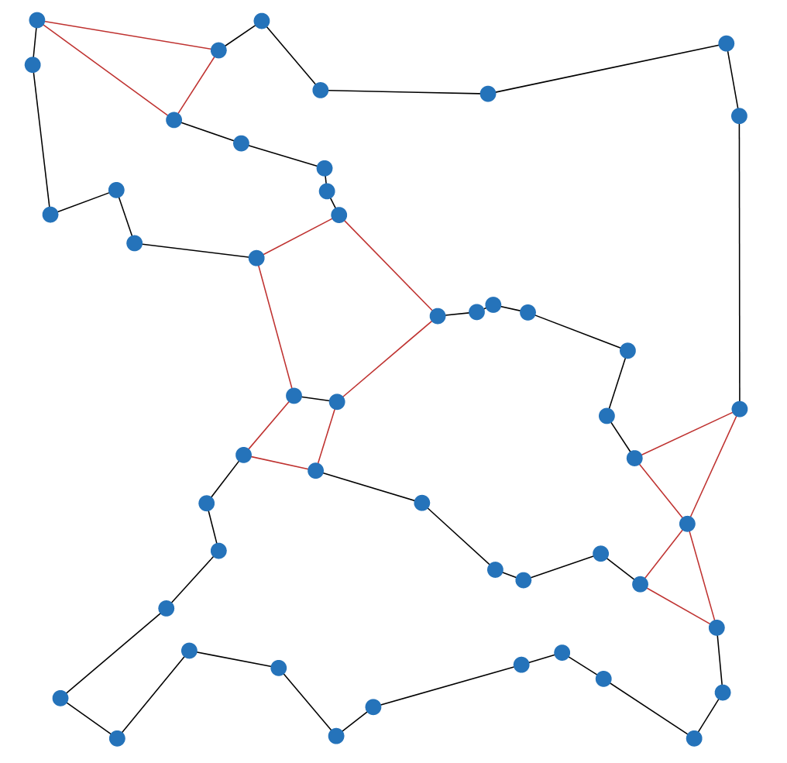

# Exercise: Implementing and Analyzing the Dantzig-Fulkerson-Johnson Formulation for TSP


The Traveling Salesman Problem (TSP) is a seminal problem in combinatorial
optimization, known for both its complexity and practical relevance. Central to
solving the TSP is the Dantzig-Fulkerson-Johnson formulation, renowned for its
effectiveness and versatility in addressing various touring problems.

**Formulation Overview:**

- **Graph Setup:** Consider a weighted graph $G = (V, E)$ with non-negative edge
  weights $c_e$.
- **Variables:** Introduce a boolean variable $x_e$ for each edge $e \in E$,
  where $x_e = 1$ if the edge is part of the tour, and $0$ otherwise.
- **Objective:** Minimize the total weight of the tour, i.e.,
  $\sum_{e \in E} c_e \cdot x_e$.
- **Vertex Constraints:** Ensure every vertex $v \in V$ is entered and left
  exactly once, i.e., $\sum_{e \in \delta(v)} x_e = 2$.
- **Subtour Prevention:** To avoid subtours, for every subset $S \subseteq V$
  with $|S| \geq 2$, add the constraint $\sum_{e \in \delta(S)} x_e \geq 2$,
  where $\delta(S)$ denotes edges with exactly one endpoint in $S$.
- **Lazy Constraints:** As there are exponentially many subsets $S$, implement
  these constraints as _lazy constraints_ through a callback function, adding
  them only when a subtour is detected in the current solution. You have seen
  such a callback function in the example above.

The complete formulation looks as follows:

$$
\begin{align*}
\min \quad & \sum_{e\in E} c_e\cdot x_e \\
\text{s.t.} \quad & \sum_{e\in \delta(v)} x_e = 2 & \forall v\in V \\
& \sum_{e\in \delta(S)} x_e \geq 2 & \forall S\subsetneq V, S\not=\emptyset \\
& x_e \in \{0,1\} & \forall e\in E
\end{align*}
$$

## Tasks

### Implement a TSP Solver in Gurobi

1. Implement a TSP Solver using above's formulation and Lazy Constraints with
   Gurobi in `solution_dantzig.py`.
2. Verify your implementation by running `python3 verify_dantzig.py` in the
   terminal. While some instances can take a few seconds, all instances should
   be solvable even on a cheap notebook.

- Note: Round variables as necessary, or use `x.X >= 0.5` to determine the value
  of `x`.
- Note: You can use NetworkX's `connected_components` to find subtours.

### Linear Relaxation

1. Implement a linear relaxation for the TSP formulation using Gurobi in
   `solution_relaxation.py`. Make sure you have understood what a linear
   relaxation is before you start. Given the previous task, it should be a very
   small step to implement the linear relaxation.
2. Verify your implementation by running `python3 verify_relaxation.py` in the
   terminal. All instances should be solved very quickly.

- Note: The instance will be given as networkx graph, with edge weights as
  attribute `weight`.
- Note: You do not need to use lazy constraints, but you have to perform
  multiple iterations and add constraints as needed.
- Note: You can use NetworkX's `connected_components` to find subtours. Assume
  an edge to be used in the tour if $x_e \geq 0.01$. Thus, in your solution, the
  graph should be connected by edges with $x_e \geq 0.01$.
- Note: You may have to make sure, the constraint you add is actually violated,
  as you otherwise run into an infinite loop.
- Note: You can copy a lot of code from the integral version.

|  |                                                                                                                                                                                       |
| :---------------------------------------------: | :----------------------------------------------------------------------------------------------------------------------------------------------------------------------------------------------------------------------------------------: |
|    An optimal integral solution for the TSP.    | _Linear Relaxation of the TSP. The red edges have fractional values, i.e., $0<x<1$, most of the time $x=0.5$. The linear relaxation is connected when applying the subtour elimination constraints on all edges with $x\geq \varepsilon$._ |

### Experimental Analysis

Gurobi can compute optimal solutions for reasonable sized instances of the TSP
thanks to the similarity of the solutions to the efficiently computable linear
relaxation. In this task, you will analyze this similarity yourself.

1. Run the block
   ```python
   # Run me to get a sample on linear relaxation and integral solution
   get_sample()
   print(f"There are now {len(samples)} samples")
   ```
   in `evaluation.ipynb` multiple times to get a set of at least 20 pairs of
   linear relaxation and integral solutions.
2. Compute the average overlap in percentage between the edges chosen in the
   linear relaxation and those in the optimal solution. An edge is considered to
   be chosen if $x_e \geq 0.5$.
3. Compute the average similarity of the objective value between the linear
   relaxation and the optimal solution. The similarity is given in percentage of
   the optimal solution. E.g., if the optimal solution has a value of 100 and
   the linear relaxation has a value of 90, the similarity is 90%.
4. Save both results in the `evaluation.ipynb` notebook for us to verify.

## References

- [Definition of Linear Relaxation on Wikipedia](https://en.wikipedia.org/wiki/Linear_programming_relaxation)
- [How do I install Gurobi for Python?](https://support.gurobi.com/hc/en-us/articles/360044290292-How-do-I-install-Gurobi-for-Python)
- [Tutorial: Getting Started with the Gurobi Python API](https://support.gurobi.com/hc/en-us/articles/17278438215313-Tutorial-Getting-Started-with-the-Gurobi-Python-API)
- [Mathematical Modelling](https://www.gurobi.com/resources/math-programming-modeling-basics/):
  A crash-course in mathematical modelling.\
- [networkx](https://networkx.org/documentation/stable/tutorial.html)
- [pre-commit](https://pre-commit.com/): We have set up a pre-commit
  configuration for you that you can use to quickly pretty up and check your
  code. You can install it by running `pip install pre-commit` and then
  `pre-commit run --all-files` to run it on all files in your repository.
- [DIY TSP Solver in the Browser](https://www.math.uwaterloo.ca/tsp/D3/bootQ.html)
- [Gurobi Model.cbLazy() Documentation](https://www.gurobi.com/documentation/current/refman/py_model_cblazy.html)
